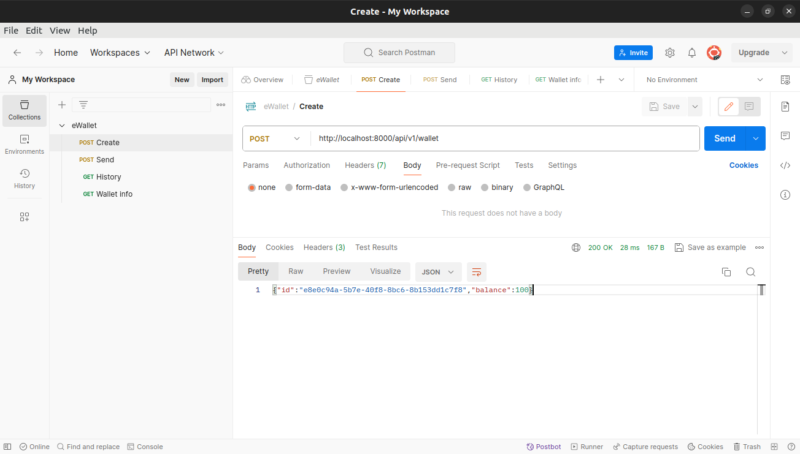
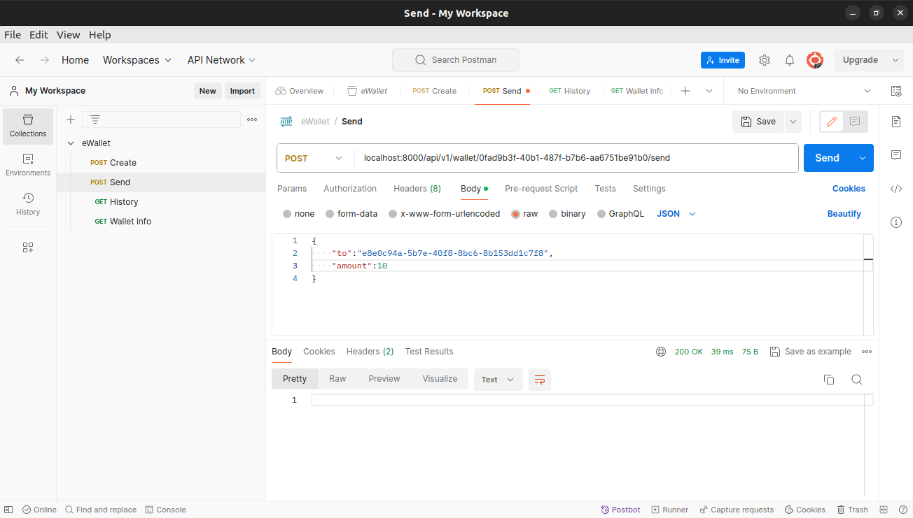
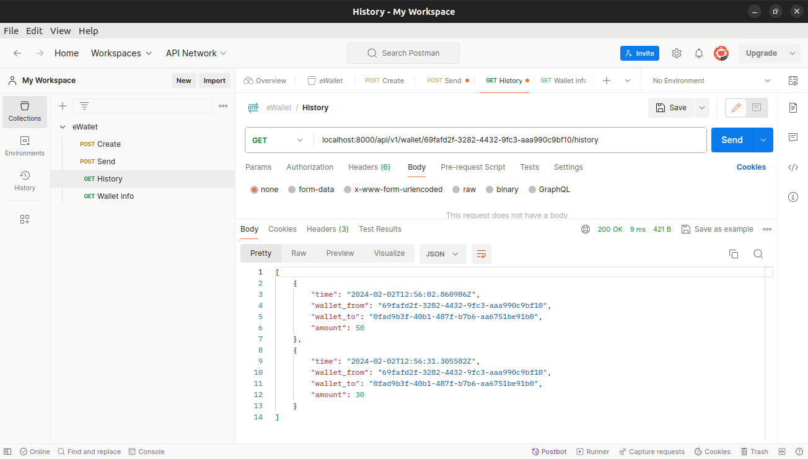
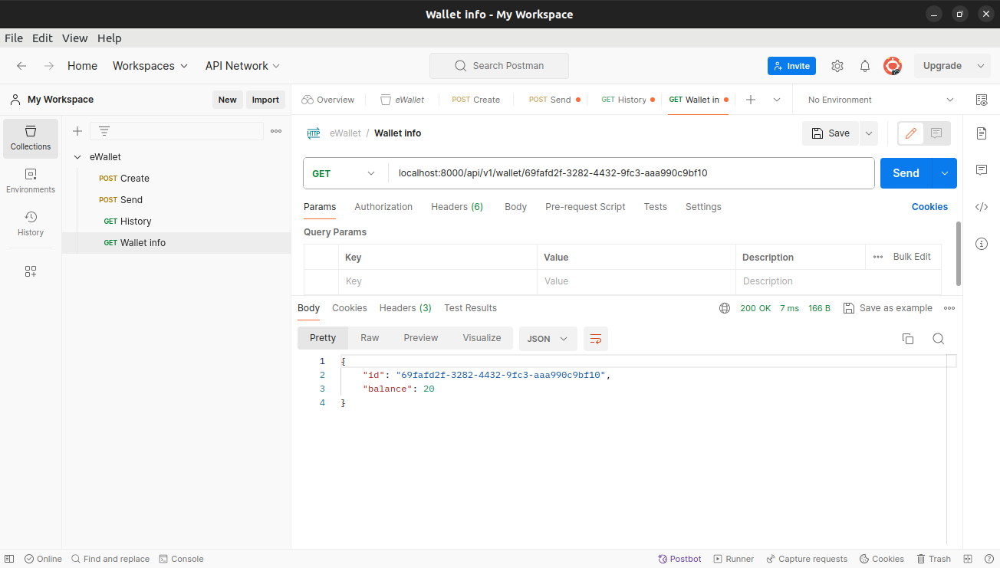

# eWallet

## Описание

Программа представляет собой "приложение eWallet", реализующее систему обработки транзакций платёжной системы.

Данная программа написана на языке программирования **Go** (версии 1.21.6), реализована в виде HTTP сервера, реализующее REST API. На сервере реализовано следующие 4 метода:

- **Создание кошелька** (POST <ins>/api/v1/wallet</ins>)
- **Перевод средств с одного кошелька на другой** (POST <ins>/api/v1/wallet/{walletId}/send</ins>)
- **Получение историй входящих и исходящих транзакций** (GET <ins>/api/v1/wallet/{walletId}/history</ins>)
- **Получение текущего состояния кошелька** (GET <ins>/api/v1/wallet/{walletId}</ins>)

## Установка и запуск

1. Для установки программы необходимо выполнить одно из действий:

    a. Скачать zip-файл по [ссылке](https://github.com/AlexPolarBear/eWallet/archive/refs/heads/main.zip
     "Download git zip-file") и распаковать его в нужный файл.

    b. Открыть терминал в нужном файле и прописать:
    
    ```bash
    git clone https://github.com/AlexPolarBear/eWallet.git
    ```

2. Далее, следует убедиться, что на Вашем устройстве установлен docker, для последующей сборки и работы с программой. Для этого в командной строке наберите:

    ```bash
    docker --version
    ```

    Если он установлен, командная строка выдаст его версию:

    ```bash
    Docker version 25.0.2
    ```

    При выводе сообщения: ```command not found``` необходимо пройти по [ссылке](https://docs.docker.com/get-docker/ "Get Docker") и воспользоваться инструкцией по установке.

3. Программа состоит из 2 частей: API и база данных (PostgreSQL). Все необходимые изображения в docker для функционирования программы загрузяться при сборке.

    Откройте терминал в папке eWallet. Для сборки и запуска введите команду:

    ```bash
    docker-compose up --build
    ```

    Далее, вы увидете запись логов и подключение к серверу.

    Для остановки программы в терминале нажмите ```ctrl + C```.

    Последующий запуск можно выполнять с командой:

    ```bash
    docker-compose up
    ```

### Альтернативный запуск

Программу можно запустить и без сборки. Для этого сконфигурируйте подключение к локальной базе данных в фале ```cmd/app/main.go``` в строке:

```go
connStr := "host=host port=port user=user password=pasw dbname=db sslmode=disable"
```

Подключитесь к данной базе через клиента, и выполните скрипт в файле ```internal/database/init.sql```.

Далее, из папки eWallet воспользуйтесь командой запуска:

```bash
сd cmd/app && go run main.go
```

## Возможные ошибки и их обработка

Все возникающие ошибки прописываются в логах системы (через терминал, или docker desktop). Тривиального и единого решения нет, и каждая ошибка должна решаться в зависимости от её контекста и места.

При возникновении серьёзных проблем, обращайтесь к [разработчику](https://github.com/AlexPolarBear) программы или [поисковой системе](https://www.google.ru/ "Google").

### Пример работы программы

Работоспособность программы тестировалась с помощью программы Postman. Была выполнена проверка всех 4 методов.

Создание кошелька:



Перевод средств с одного кошелька на другой:



Получение историй входящих и исходящих транзакций:



Получение текущего состояния кошелька:


